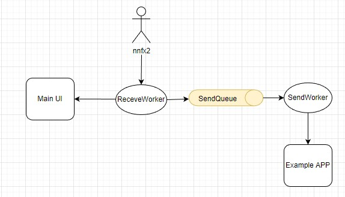

# 개발환경

1. python : python 3.9.5
2. pip(python library) : pip install numpy, pyserial, pyqtgraph, pyside6, rpyc
3. 실행방법
   3.1. 뇌파측정 기기에서 데이터 수신 및 UI프로그램 :python main.py
   3.2. 수신한 데이터를 외부프로그램에서 전달받는 예제 프로그램 : python example_app.py

# 소스코드 목록

## mainwindow.py, mainwindow.ui, main.py

```
GUI UI 구성을 위해 pyside6(QT) 라이브러를 사용합니다. 
QT Designer로 생성한 mainwindow.ui를 "pyside6-uic mainwindow.ui -o mainwindow.py" 명령어를 사용해 mainwindow.py로 변환하고, 
main.py 에서 프로그램 시작 및 UI를 생성합니다. 
```

## example_app.py

```
기기에서 수신한 데이터는 rpyc 모듈(https://rpyc.readthedocs.io/en/latest/)을 통해서 socket 방식으로 외부 프로그램에 전달합니다. 
send_worker.py의 self.rpy.root.recv_data(data) 에서 데이터를 전송하면, example_app.py의 RecvService.exposed_recv_data(self, data)가 호출되어 데이터를 수신할수 있습니다.
자세한 내용은 https://rpyc.readthedocs.io/en/latest/tutorial/tut3.html 를 참조하시면 될거 같습니다.
```

## receive_worker.py, send_worker.py

프로그램은 nnfx2에서 데이터를 수신하는 ReceiveWorker와 example_app으로 데이터를 전달하는 SendWorker로 구성되어 있습니다.


* receive.worker.py : nnfx2에서 수신한 시리얼 데이터를 Main UI에 전달하고, SendQueue에 전송한다.
* send_worker.py : SendQueue에서 데이터를 받아, example_app으로 전달한다.

# 데이터 포맷

nnfx2에서 수신한 데이터는 byte로 되어있고, Stream 방식이기때문에 python의 dictionary로 변환하여 사용합니다.

```
data = {
       "mode": packet.get_mode(),  # 실행모드
       "ch1": packet.get_ch1_value(),  # 좌뇌(CH1)
       "ch2": packet.get_ch2_value(),  # 우뇌(CH2)
       "ch3": packet.get_ch3_value(),  # Power Spectrum
       "ch3_n": self.ch3_n,  # Power Spectrum N value
       "ch4": packet.get_ch4_value(),  # CH4(맥파(ppg))
       "ch5": packet.get_ch5_value(),  # CH5(이차미분맥파)
       "ch6": packet.get_ch6_value(),  # CH6(peak-interavl)
       "ch1_status": packet.get_ch1_status(),  # CH1 부착상태
       "ch2_status": packet.get_ch2_status(),  # CH2 부착상태
       "ref_status": packet.get_ref_status(),  # 귓볼 부착상태
       "battery_status": packet.get_battery_status(),  # 배터리 상태
       "org_packet": packet.org_packet.hex(),  # Packet 분석 전 origianl 패킷bytes
       "packet_count": packet.packet_count(),  # Packet Cyclic Count
       "timestamp": time.time(),  # timestamp
}
```

```
# Example 
{
   "mode":"측정모드",
   "ch1":-5.30082,
   "ch2":-47.92374,
   "ch3":0.0,
   "ch3_n":296,
   "ch4":16238,
   "ch5":-3393,
   "ch6":0,
   "ch1_status":32,
   "ch2_status":16,
   "ref_status":8,
   "battery_status":"None",
   "org_packet":"fffe016207ffa93e3f6d3acf00003f6e32bf0000",
   "packet_count":7,
   "timestamp":1655271402.7805839
}
```
